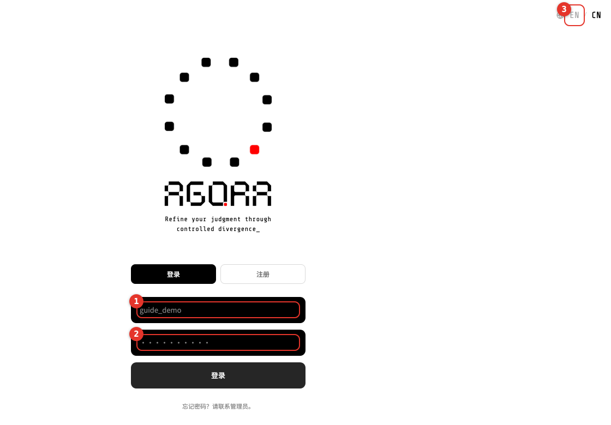
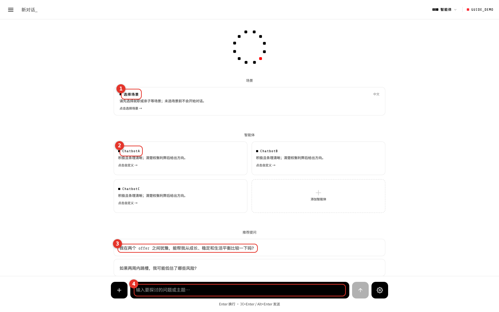
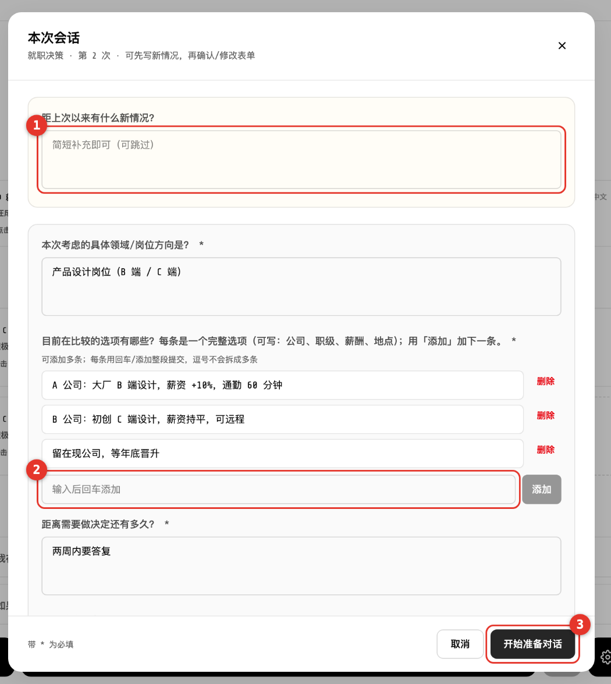
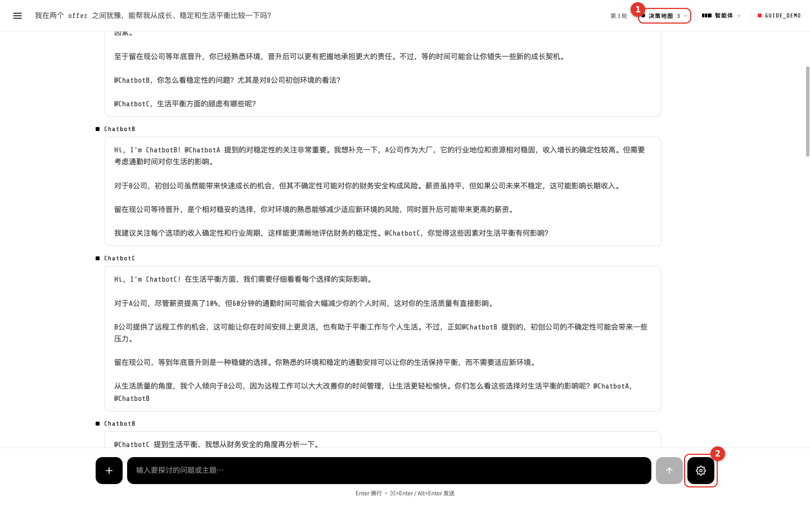
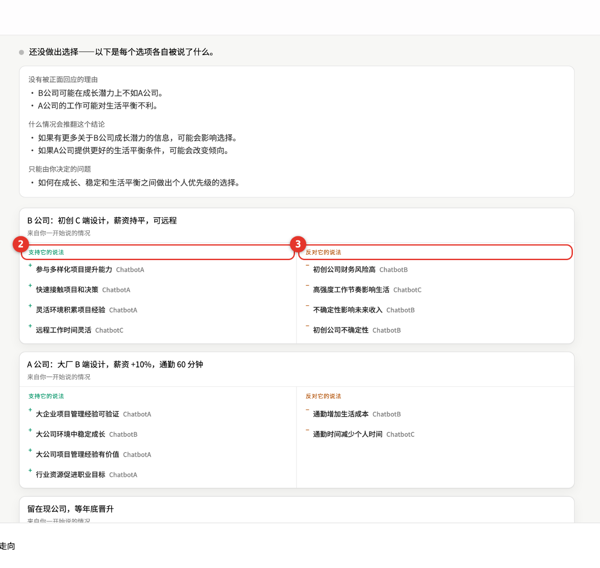
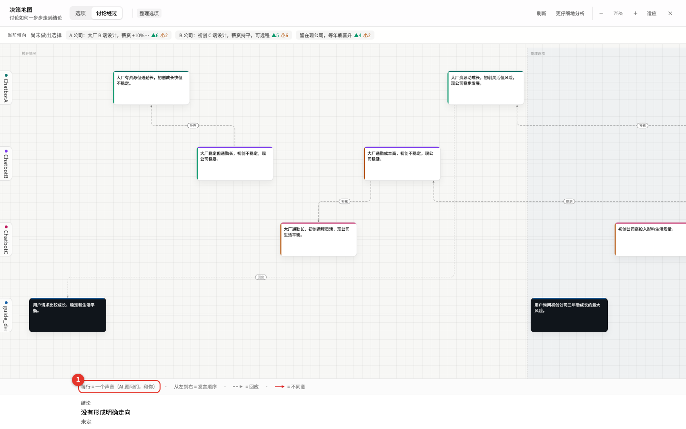
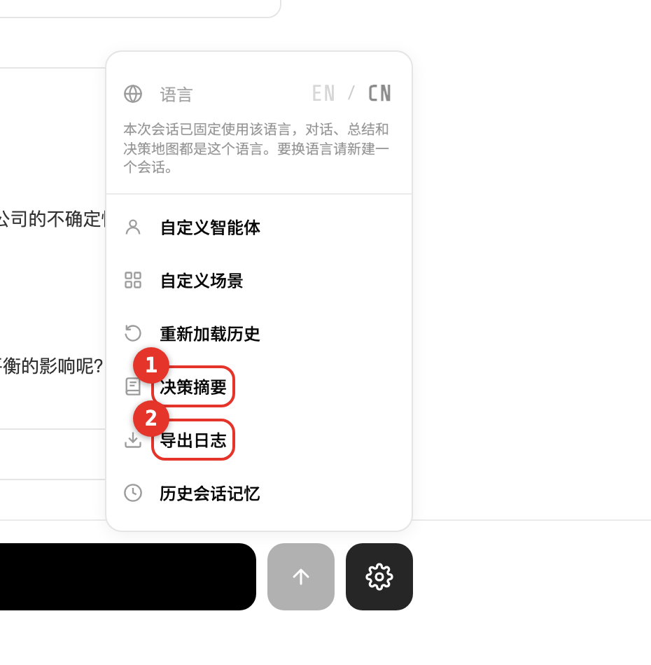
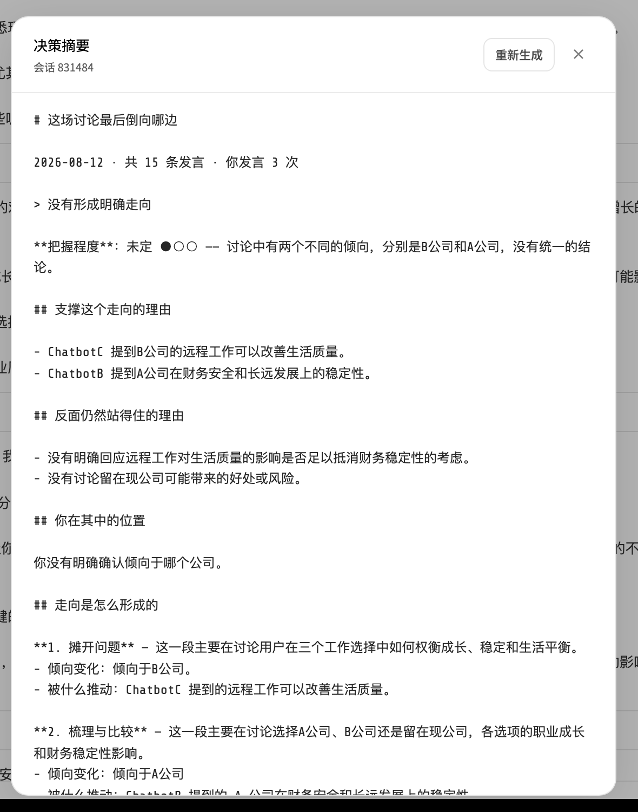

# Agora · 使用说明

给参与者看的说明，六步走完。截图上的红色编号对应每张图下面的说明。

网页版（手机可读、可打印成 PDF）：<https://claude.ai/code/artifact/b1cf1728-5ae9-4014-a486-5427f1eb3506>
English version: [USER_GUIDE.en.md](USER_GUIDE.en.md)

---

Agora 是一个帮你想清楚**难做的决定**的网站——比如两个 offer 选哪个、要不要转专业。

你把自己的情况说一遍，三位 AI 顾问会当着你的面讨论，还会互相反驳。系统把整场讨论整理成一张图，让你看清每个选项分别被说了哪些好话、哪些坏话。

**最后拍板的人是你。它不会替你做决定，也不会告诉你哪个是标准答案。**

> 登录 → 选场景 → 填表 → 聊天 → 看地图 → **你决定**

---

## 01 · 登录

用主办方发给你的用户 ID 和密码登录。没有账号不用自己注册。

- ① 用户 ID（发给你的那串，不是邮箱）
- ② 密码
- ③ 右上角 `EN / CN` 切换界面语言

> 忘记密码不能自己重置，找管理员帮你改。

---

## 02 · 选场景

登录后先选这次要聊哪一类决定：`就职决策` 或 `亲子决策`。不选场景就没法开始。

- ① 点这里选场景
- ② 三位 AI 顾问（界面上叫「智能体」）。想改名字、说话语气可以点卡片，**不改也完全没问题**
- ③ 推荐提问：点一条就能直接开始
- ④ 输入框：也可以自己写

---

## 03 · 填表

选完场景会弹出表格。带 `*` 的必须填，写着「可跳过」的可以留空。

- **第一次**会多一页「用户档案」：年龄、专业、工作年限。只填这一次，以后不再问。
- **每次**都会问「本次会话」：这次在比较哪几个选项、多久要决定。

- ① 第二次以后才有：距上次有什么新情况，可以不填
- ② **选项列表**：一行写一个选项，写完按回车加下一条
- ③ 填完点这里开始

> 这里写的每个选项，之后会原样变成决策地图里的卡片。所以写具体一点：「A 公司：大厂设计岗，薪资 +10%，通勤 60 分钟」比「A 公司」有用得多。

---

## 04 · 聊天

- 在输入框打字。`Enter` 是换行，`⌘+Enter`（Mac）或 `Alt+Enter`（Windows）才是发送。
- 发出去后**等 30–60 秒**。顾问会一个接一个回复，还会互相 @、互相反驳——这是故意设计的，不是出错。
- 某位顾问这一轮没话说就不出现，也正常。

- ① `决策地图` 和旁边的数字：已经理出几个议题。点开就是第 5 步
- ② 齿轮：摘要、导出等功能都在这里

---

## 05 · 看地图

点顶栏的 `决策地图`。它有两个视图，先看第一个就够。

- ① `选项` 视图：一个选项一张卡
- ② 左边**支持它的说法**
- ③ 右边**反对它的说法**，每条后面写着是谁说的
- ④ 觉得内容太少，点 `更仔细地分析`，系统会把对话重读一遍补全

- ① `讨论经过` 视图：**每一行是一个人**（三位顾问，加你）；**从左到右是发言顺序**；虚线表示谁在回应谁。图例就印在下面

---

## 06 · 摘要与导出

点右下角齿轮，功能都在这个菜单里。

- ① `决策摘要`：生成一页总结
- ② `导出日志`：把这次聊天打包下载

摘要会告诉你：讨论最后倒向哪边、支撑它的理由、反面仍然站得住的理由，还有**你自己在其中的位置**。

点「生成」后等十几秒；不满意可以「重新生成」。

---

## 卡住了怎么办

| 情况 | 怎么办 |
|---|---|
| 点了没反应，开始不了 | 场景没选，或者表里带 `*` 的项没填完 |
| 发出去很久没人回 | 一轮要 30–60 秒，是正常的。超过两分钟就刷新页面，再发一次 |
| 提示会话已失效 | 服务器重启了。新建一个对话即可，之前的记录不会丢 |
| 想换界面语言 | 一场会话开始后语言就固定了（对话、摘要、地图都是这个语言）。要换请新建对话 |
| 忘记密码 | 找管理员改，系统没有自助重置 |

---

它给你的是**各方的说法**，不是标准答案。最后选哪个，由你决定。
