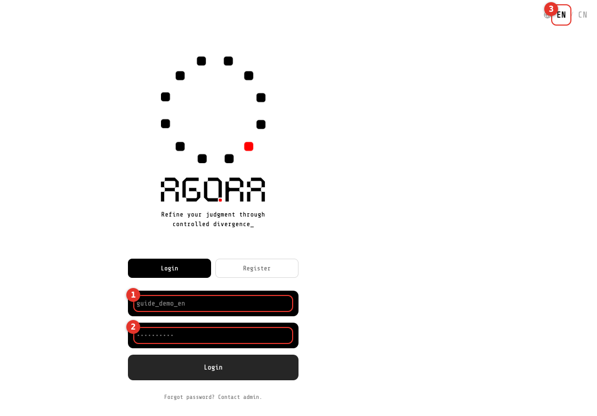
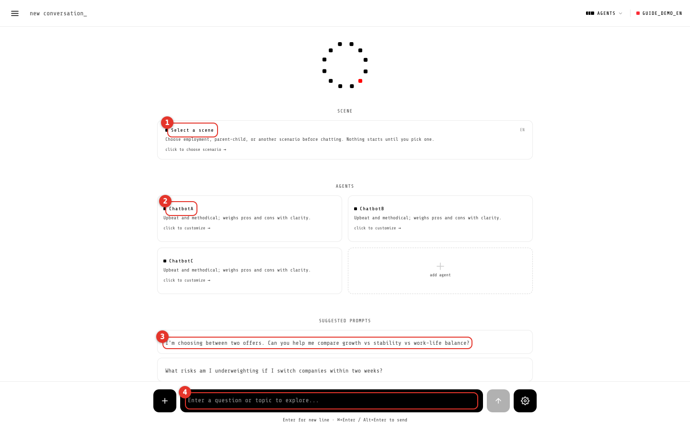
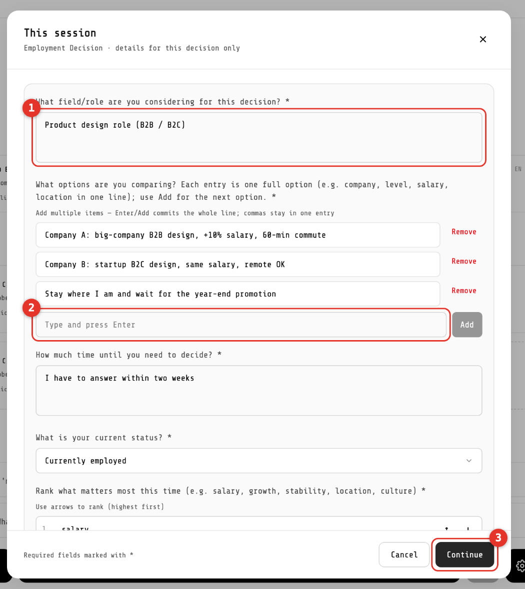
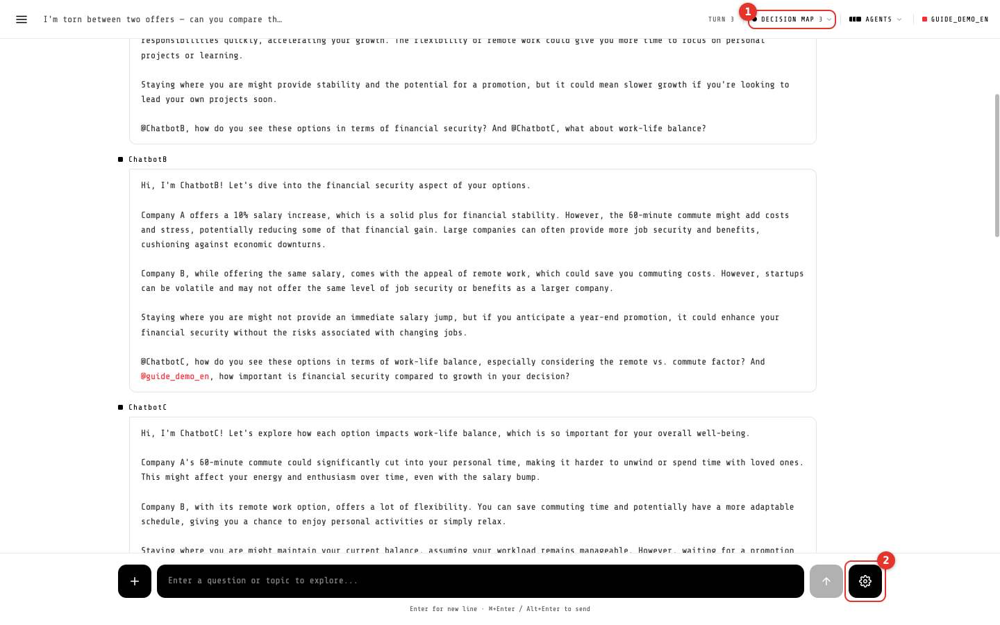
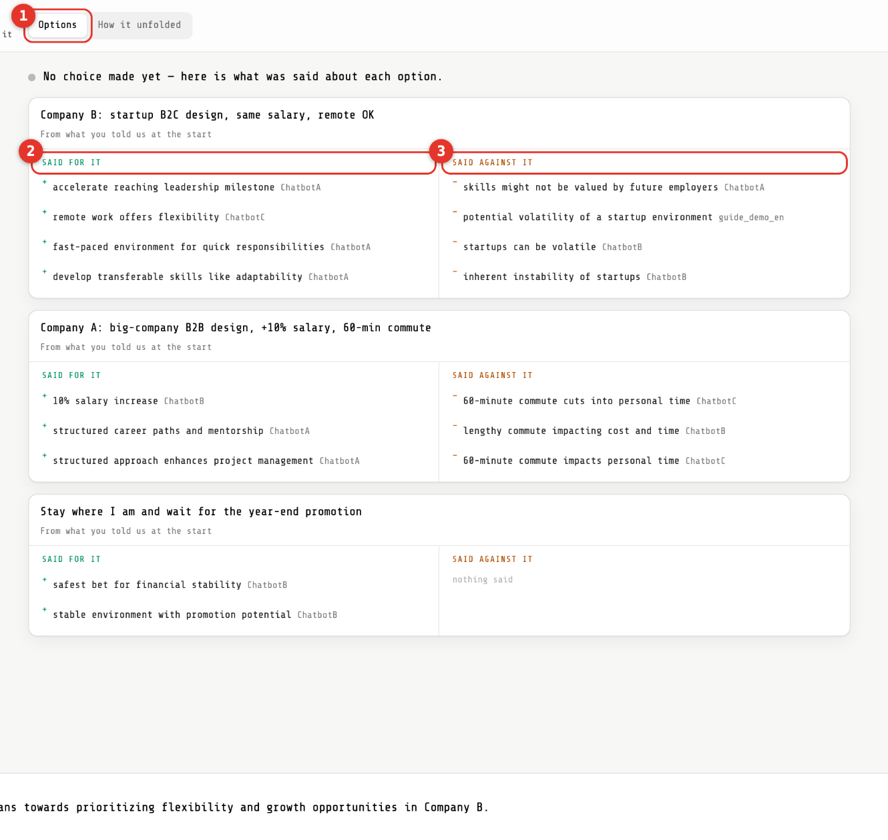
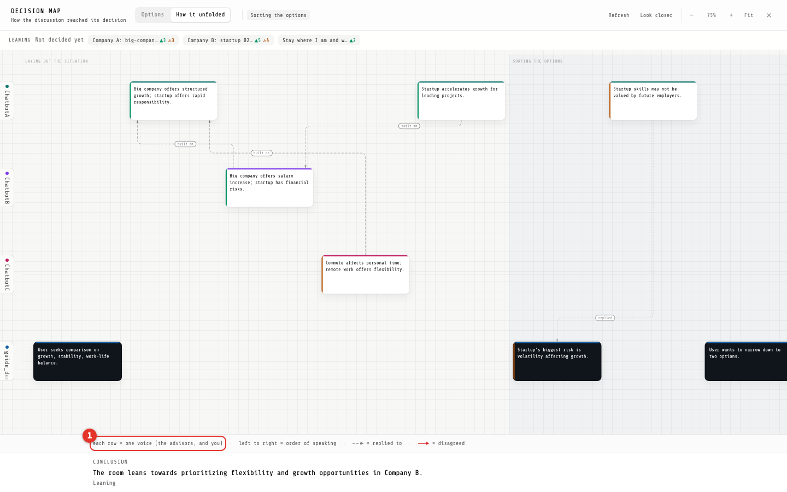
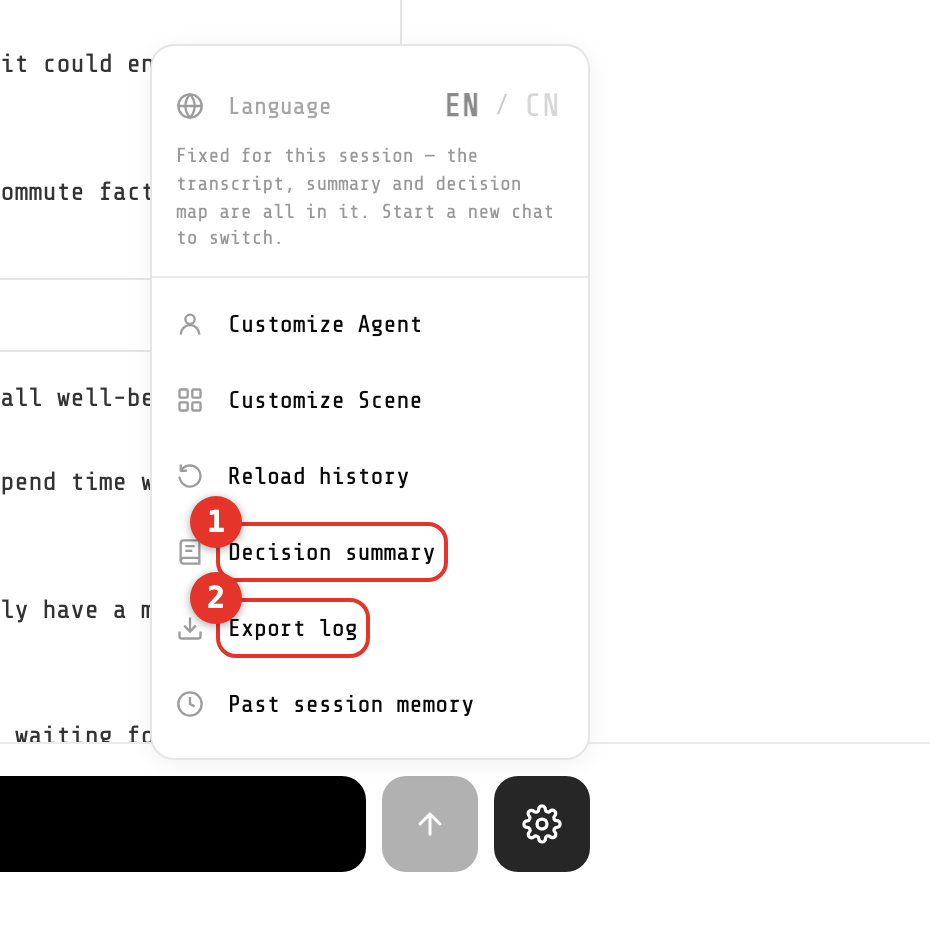
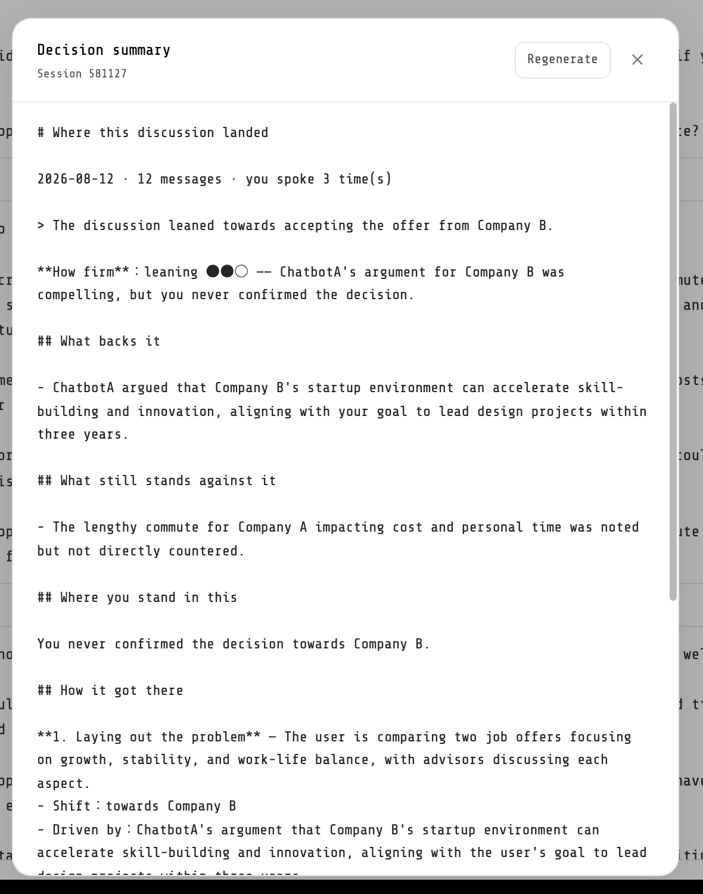

# Agora · User guide

For participants. Six steps. The red numbers on each screenshot match the notes below it.

Web version (shown after you enter your ID; switches language): <https://claude.ai/code/artifact/197a6de6-9454-43d3-8a3d-49a6ce4550ab>
中文版: [USER_GUIDE.P33-P44.zh.md](USER_GUIDE.P33-P44.zh.md) / 日本語版: [USER_GUIDE.P33-P44.ja.md](USER_GUIDE.P33-P44.ja.md)

---

Agora is a website that helps you think through a **hard decision** — which of two job offers to take, whether to switch majors.

You describe your situation once. Three AI advisors then discuss it in front of you, and they push back on each other. The system turns the whole discussion into a map, so you can see what was said for and against each option.

**You make the call. Agora will not decide for you, and there is no right answer waiting at the end.**

> Log in → Pick a scene → Fill the form → Chat → Read the map → **You decide**

---

## 01 · Log in

Use the user ID and password you were given. You do not need to register your own account.

- ① User ID (the string you were given — not an email)
- ② Password
- ③ `EN / CN` in the top right switches the interface language

> There is no self-service password reset. If you lose it, ask the admin to set a new one.

---

## 02 · Pick a scene

Pick a scene first. Nothing starts until you do.

- ① Click here to choose the scene
- ② Your three AI advisors (the interface calls them "agents"). You can rename them or change how they talk — **leaving them as they are is completely fine**
- ③ Suggested prompts: click one to start straight away
- ④ Or type your own question here

The study runs `Employment` only; the other card is greyed out, marked "not in this study", and does not respond.

---

## 03 · Fill the form

Picking a scene opens a form. Fields marked `*` are required; anything marked optional can stay empty.

- **The first time** there is an extra page — your profile: age, background, years of experience. You fill it once and never again.
- **Every time** you are asked about this session: which options you are comparing, and how long you have to decide.
- **From the second session on** there is also a short "what has changed since last time" box. You can skip it.

- ① What this decision is about (required)
- ② **The options list**: one option per line, press Enter to add the next
- ③ Click here when you are done

> Each option you type here becomes a card in the decision map later, word for word. So be specific: "Company A: big-company design role, +10% salary, 60-min commute" is far more useful than "Company A".

---

## 04 · Chat

- Type in the box. `Enter` adds a new line — `⌘+Enter` (Mac) or `Alt+Enter` (Windows) sends.
- After you send, **wait 30–60 seconds**. The advisors answer one after another, and they @ and contradict each other on purpose. That is the design, not a bug.
- If an advisor has nothing to add that round, it simply stays quiet. Also normal.

- ① `Decision map` and its number: how many topics have been sorted out so far. Opening it is step 5
- ② The gear: the summary and the rest live in this menu

---

## 05 · Read the map

Click `Decision map` in the header. It has two views; the first one is usually all you need.

- ① `Options` view: one card per option
- ② Left column — **said for it**
- ③ Right column — **said against it**, with who said it after each line
- ④ Looks thin? Click `Look closer` and the system re-reads the conversation to fill in more

- ① `How it unfolded` view: **each row is one voice** (the three advisors, and you); **left to right is speaking order**; dashed lines mean one turn answering another. The key is printed along the bottom

---

## 06 · Summary

Click the gear in the bottom right — everything else lives in that menu.

- ① `Decision summary`: writes a one-page recap

The summary tells you which way the discussion leaned, what supports that direction, what still stands against it, and **where you yourself stand in it**.

Press Generate and wait ten-odd seconds; you can regenerate if it misses the point.

---

## When you get stuck

| Situation | What to do |
|---|---|
| Nothing happens when I click start | No scene picked, or a required (`*`) field is still empty |
| I sent a message and nobody answers | A round takes 30–60 seconds — that is normal. Past two minutes, reload the page and send it again |
| It says the session expired | The server restarted. Start a new chat; nothing you already sent is lost |
| I want to switch language | The language is fixed once a chat starts — transcript, summary and map are all in it. Start a new chat to switch |
| I forgot my password | Ask the admin to reset it. There is no self-service reset |

---

What you get is **what each side said**, not the right answer. Which one to take is yours to decide.
