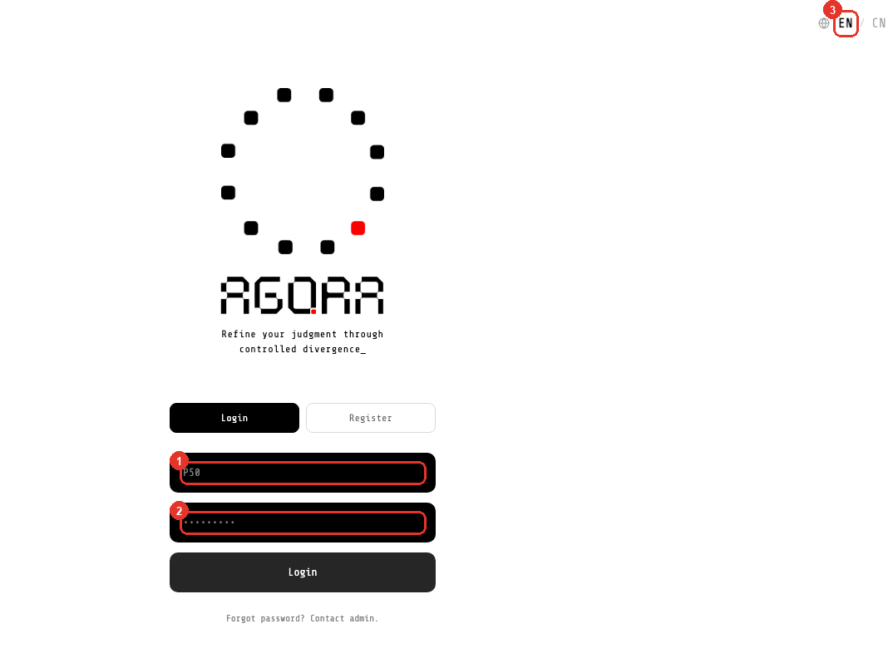
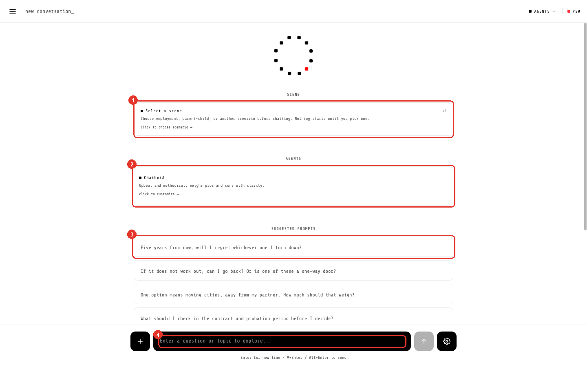
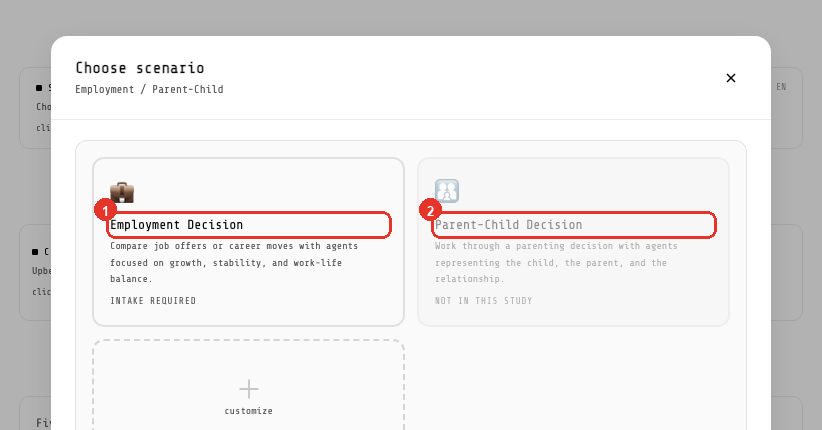
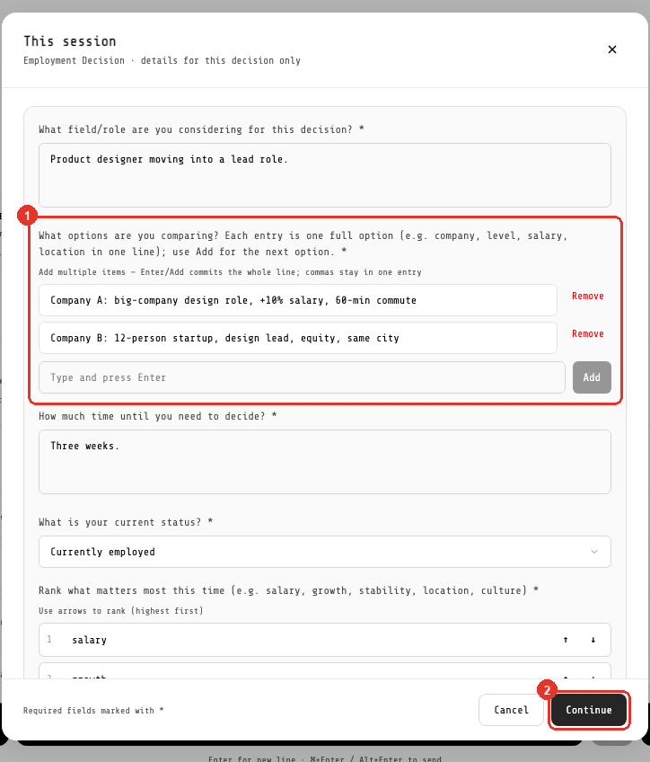
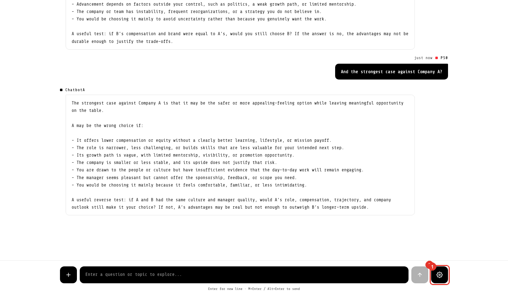

# Agora · 使い方ガイド

参加者向けの説明です。全部で 4 ステップ。スクリーンショットの赤い番号が、その下の説明とつながっています。

Web 版（ID を入力すると表示されます／言語切替あり）: <https://claude.ai/code/artifact/8700c202-f06b-49ff-b3ed-1c875a09603c>
中文版: [USER_GUIDE.P45-P56.zh.md](USER_GUIDE.P45-P56.zh.md) / English version: [USER_GUIDE.P45-P56.en.md](USER_GUIDE.P45-P56.en.md)

> 画面の表示は **英語と中国語だけ** です。日本語の画面はありません。このガイドは英語の画面で説明します（右上の `EN / CN` は `EN` のままでかまいません）。

---

Agora は、**決めにくいこと**を考え整理するためのサイトです。たとえば、2 つの内定のどちらを選ぶか、専攻を変えるかどうか。

自分の状況を一度書くと、AI アドバイザーが一緒に考えます。理由を挙げ、その裏にある代償も指摘します。

**決めるのはあなたです。Agora が代わりに決めることはありませんし、最後に正解が用意されているわけでもありません。**

> ログイン → シーンを選ぶ → フォームを書く → 話す → **あなたが決める**

---

## 01 · ログイン

配られたユーザー ID とパスワードでログインします。自分でアカウントを作る必要はありません。

- ① ユーザー ID（配られた文字列です。メールアドレスではありません）
- ② パスワード
- ③ 右上の `EN / CN` で画面の言語（英語／中国語）を切り替えます

> パスワードを自分でリセットする機能はありません。忘れたら管理者に再設定してもらってください。

---

## 02 · シーンを選ぶ

まずシーンを選びます。選ばないと始まりません。

- ① ここをクリックしてシーンを選びます
- ② あなたの AI アドバイザー（画面では「agents」と表示されます）
- ③ 質問の例：クリックすればすぐ始められます
- ④ 入力欄：自分で書いてもかまいません

開くとこうなります。今回の研究で使うのは `Employment`（就職の決断）だけです。もう一方のカードは灰色で「not in this study」と出ていて、押せません。

---

## 03 · フォームを書く

シーンを選ぶとフォームが開きます。`*` が付いた項目は必須、`optional` と書かれた項目は空欄のままでかまいません。

- **初回だけ**、プロフィールのページが 1 枚増えます（年齢、専攻・分野、経験年数）。入力は最初の 1 回だけで、次からは聞かれません。
- **毎回**、今回のセッションについて聞かれます。どの選択肢を比べているか、いつまでに決める必要があるか。
- **2 回目以降**は「前回から変わったこと」を書く欄も出ます。書かなくても大丈夫です。

- ① **選択肢のリスト**：1 行に 1 つ書いて、`Enter` で次の行を追加します
- ② 書き終えたらここをクリック

> 具体的に書いてください。「A 社」より「A 社：大手のデザイン職、給与 +10%、通勤 60 分」のほうが、ずっと役に立ちます。アドバイザーは書かれたことしか手がかりにできません。

---

## 04 · 話す

- 入力欄に打ち込みます。`Enter` は改行です。送信は `⌘+Enter`（Mac）または `Alt+Enter`（Windows）。
- 送ったら**{{WAIT}}待つ**と、アドバイザーが答えます。
- もっと聞きたいときは、そのまま重ねて聞いてください。「それを選ぶと何を失いますか」「逆の立場だとどうですか」。

- ① 歯車：画面の言語などの設定はこのメニューの中にあります

---

## うまくいかないとき

| こんなとき | どうするか |
|---|---|
| 押しても何も起きず、始まらない | シーンを選んでいないか、`*` の必須項目がまだ空です |
| 送ったのに何も返ってこない | 1 ターンに {{WAIT}}かかります。正常です。2 分を超えたらページを再読み込みして、もう一度送ってください |
| セッションが切れたと表示される | サーバーが再起動しました。新しい会話を始めてください。それまでの記録は消えません |
| 画面の言語を変えたい | 会話を始めると言語は固定されます。変えるには新しい会話を始めてください |
| パスワードを忘れた | 管理者に再設定してもらってください。自分でリセットする機能はありません |

---

ここで手に入るのは**それぞれの立場の言い分**であって、正解ではありません。どれを選ぶかは、あなたが決めることです。
